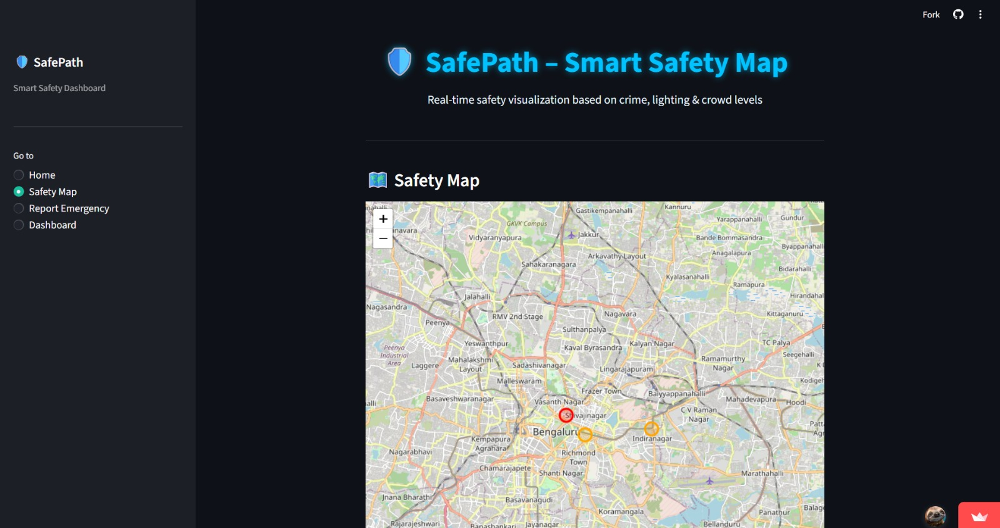
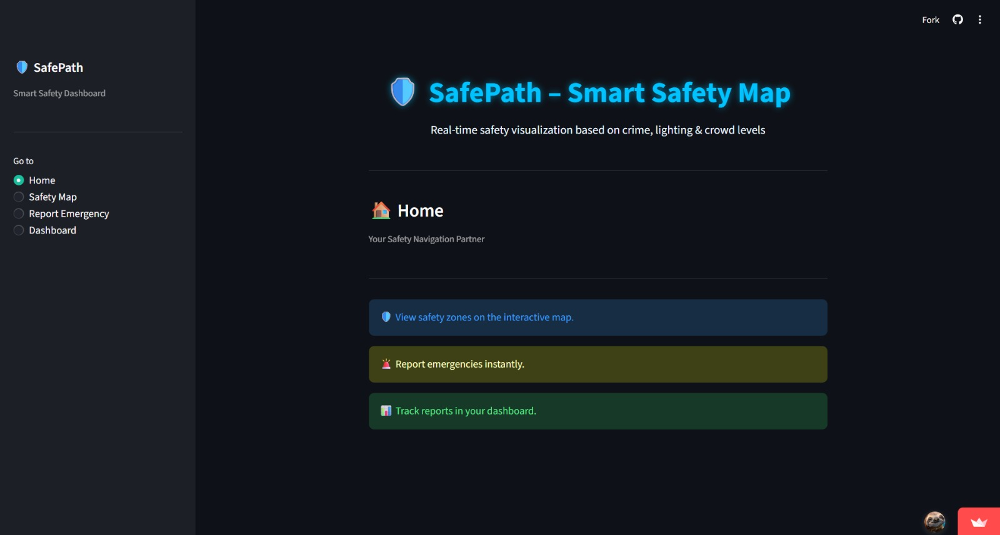
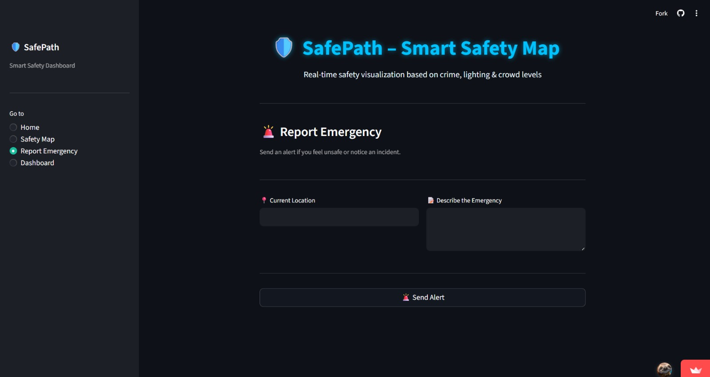
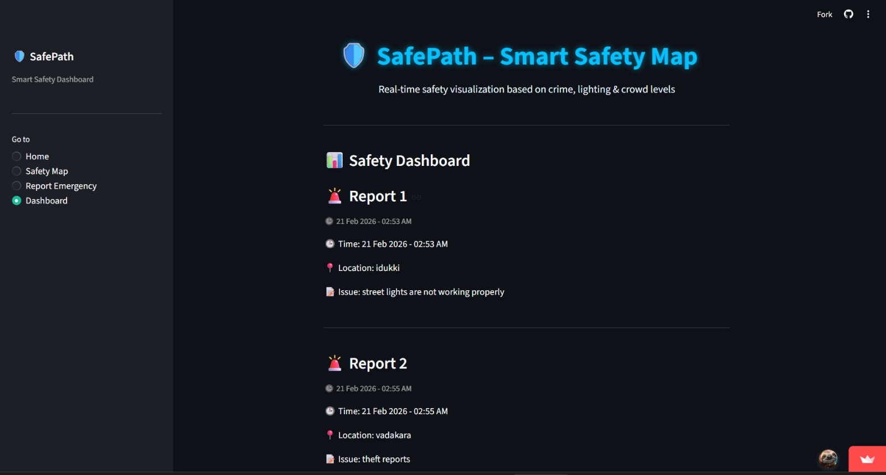

# SafePath  

## Basic Details

### Team Name: TechRift  

### Team Members

  * Member 1: Arshiya Sulfikkar - Muthoot Institute of Technology and Science  
  * Member 2:Hridya K K - Muthoot Institute of Technology and Science
### Hosted Project Link

https://tinkher4.streamlit.app/ 

### Project Description

SafePath is a safety mapping web application that analyzes and visualizes location-based safety scores. It helps users identify safer routes and areas using data-driven insights displayed on an interactive map.

### The Problem statement

Many people, especially women and students, lack access to reliable information about the safety of specific areas. There is no easy way to visualize and compare safety levels across locations before traveling.

### The Solution

SafePath provides an interactive map that categorizes areas into Safe, Moderate, and Unsafe zones based on calculated safety scores. The platform offers a simple and intuitive visualization to help users make informed travel decisions.

* * *

## Technical Details

### Technologies/Components Used

For Software:

  * Languages used: Python, HTML, CSS  
  * Frameworks used: Streamlit  
  * Libraries used: Folium, Pandas  
  * Tools used: VS Code, Git, GitHub  
 
* * *

## Features

List the key features of your project:

  * Feature 1: Interactive safety map visualization  
  * Feature 2: Color-coded safety legend (Safe, Moderate, Risky)  
  * Feature 3: Dynamic safety score calculation  
  * Feature 4: Clean and responsive web interface  

* * *

## Implementation

### For Software:
###  Installation:
*git clone <https://github.com/HridyaKK/tinkher4>

*cd safepath

*python -m venv venv

*venv\Scripts\activate

*pip install -r requirements.tx
#### Run:
streamlit run app.py
## Project Documentation

### For Software:

#### Screenshots 

  
Interactive safety map showing categorized locations  

  
Home page of the website showing overview of the website  

  
emergancy reporting with time , location and issue
  
display of the reports by diff users

### System Architecture:

### Application Workflow:

